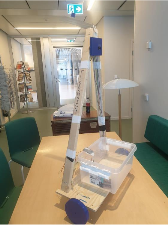
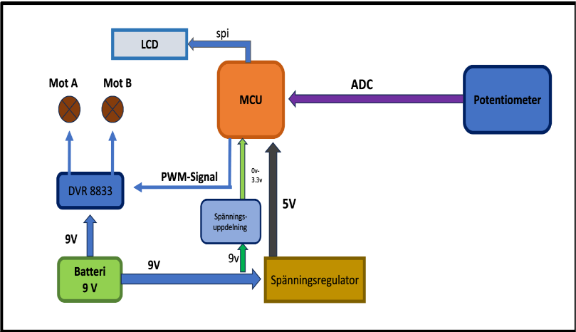
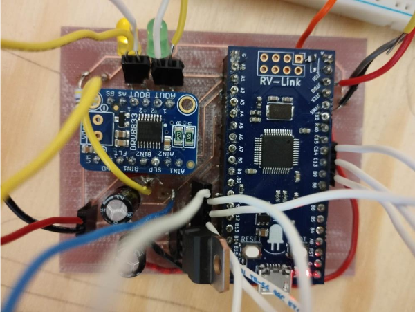
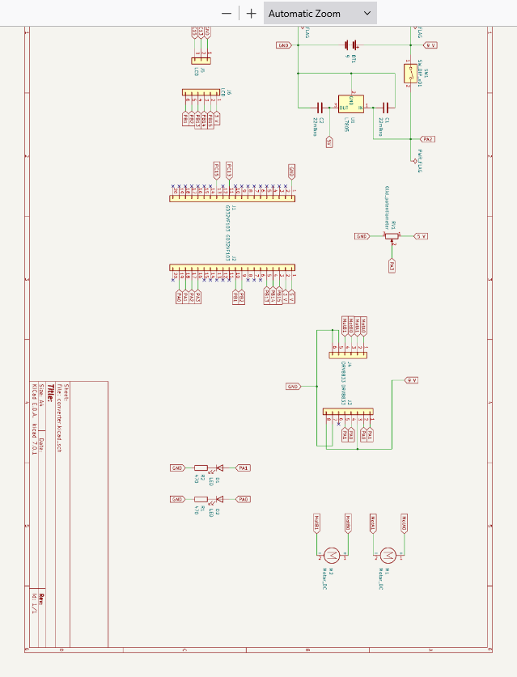
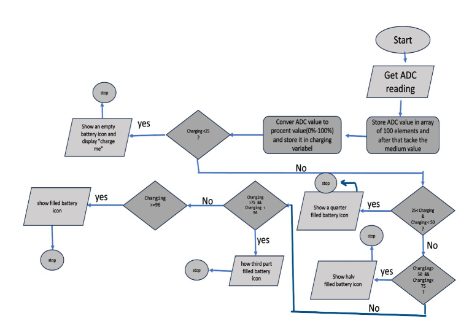
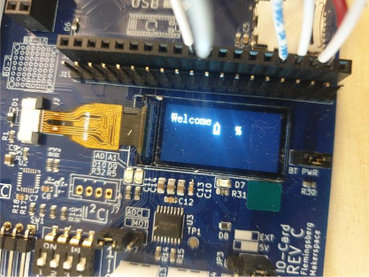

# El-Dramaten – Embedded Motor Control System

El-Dramaten is a motorized shopping trolley prototype developed as part of the **HE1043 Project Course at KTH Royal Institute of Technology**.

The project combines **embedded systems, electronics, motor control and hardware design** to create a prototype intended to reduce the physical effort required when transporting groceries.

## Prototype



The prototype integrates the mechanical trolley structure with a custom electronic control system, DC motors, battery monitoring and a user interface.

## System Overview

The control system is built around a **GD32VF103 RISC-V 32-bit microcontroller**.

A potentiometer provides an analog input representing the desired motor control. The signal is read using the microcontroller's **ADC (Analog-to-Digital Converter)** and used to generate **PWM (Pulse Width Modulation)** signals.

The PWM signals control the DC motors through a **DRV8833 dual H-bridge motor driver**, allowing the system to control motor speed and direction.

Battery voltage is also monitored through the ADC and the battery status is presented to the user through an LCD interface.



## Key Features

- DC motor speed control
- Forward and reverse motor operation
- PWM-based motor control
- Analog input using ADC
- Battery voltage monitoring
- LCD battery status display
- Low-battery indication
- Emergency stop functionality
- Custom electronic circuit
- PCB design and manufacturing files
- Integration of embedded software and hardware

## Hardware & Electronics

### Control Electronics

The electronic control system connects the microcontroller, motor driver, power electronics and other components required to operate the prototype.



### Circuit Schematic

The electronic circuit was designed to integrate the microcontroller, motor driver, power supply, motors and supporting components.



## Motor Control

The potentiometer provides an analog voltage that is sampled by the microcontroller's ADC.

The ADC value is converted into a digital control value and used by the embedded software to determine the required motor behavior.

PWM signals are then generated to control the motor speed through the DRV8833 motor driver.

The system supports:

- Forward movement
- Reverse movement
- Stop
- Variable motor speed

## Battery Monitoring

Battery voltage is measured using the microcontroller's ADC.

Multiple ADC measurements are collected and processed before the calculated battery level is presented on the LCD.

The battery monitoring logic determines the battery status and selects the corresponding battery indicator.



### LCD Interface

The LCD provides visual feedback about the system and battery status.



## Technologies & Components

### Software

- C
- Embedded C
- Embedded Systems
- RISC-V
- PWM control
- ADC processing

### Hardware

- GD32VF103 RISC-V microcontroller
- DRV8833 dual H-bridge motor driver
- DC motors
- Potentiometer
- LCD
- Battery-powered electronics
- Custom electronic circuitry

### Design & Development

- KiCad
- PCB design
- Circuit design
- Hardware integration
- Embedded software development
- System testing
- Technical documentation

## Repository Structure

```text
el-dramaten-embedded-system/
│
├── firmware/
│   └── Embedded C source code and firmware
│
├── hardware/
│   └── PCB manufacturing and hardware files
│
├── images/
│   └── Project photos, diagrams and schematics
│
└── README.md
```

## Team Project

El-Dramaten was developed as a team project as part of the **HE1043 Project Course at KTH Royal Institute of Technology**. The project involved embedded software development, electronics, hardware integration, testing and technical documentation.
